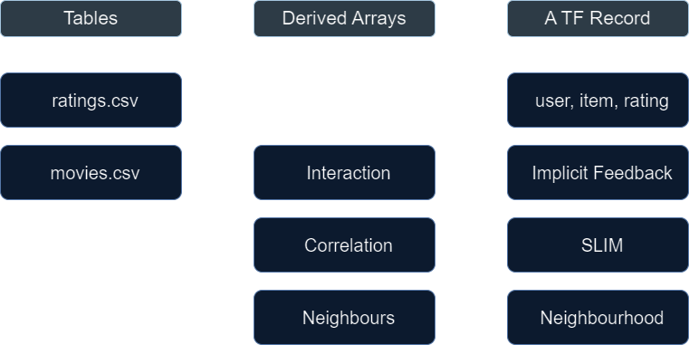
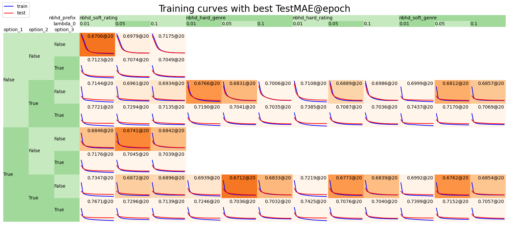

# Colaborative Filtering

------

[![Contributors][contributors-shield]][contributors-url]
[![Forks][forks-shield]][forks-url]
[![Stargazers][stars-shield]][stars-url]
[![Issues][issues-shield]][issues-url]
[![MIT License][license-shield]][license-url]
[![LinkedIn][linkedin-shield]][linkedin-url]

------

## About the project

A demo of collaborative filtering based on -

    1. Latent factors
    2. Implicit feedback
    3. Neighbourhood
    4. SLIM algorithm

### Data

#### Overall workflow
To be capable of processing data with large numbers of users and items, the source data is read and processed in chunks, and both the source and target data are stored in PyTables format:


#### Data relations
To create the final set of TFRecords for model training, some intermediate arrays are derived, which include, namely, "interaction", "correlation", and "neighbours":



For more explanation about the three arrays, refer to the Jupyter Notebook in `./demo`.

### Model

A TensorFlow model was created with the three individual on-off options available:


For more details, refer to the Jupyter Notebook in `./demo`.

### Some training curves

The small MovieLens dataset "ml-latest-small" with ~100,000 ratings is used for this demo.



For details about the searched parameters, refer to the Jupyter Notebook in `./demo`.

## Tested environment

![python][python-shield]

## Download and use

1. Clone this repository

```
git clone https://github.com/rmwkwok/colabfilter.git
cd colabfilter
```

2. (Recommended) Setup and activate virtual environment

```
virtualenv venv
source venv/bin/activate
```

3. Install requirements
```
pip install -r requirements.txt
```

4. (Recommended) Add kernel for the created virtual environment to be usable in Jupyter
```
python -m ipykernel install --user --name=colabfilter-venv
```

5. Build cython programs (correlations and neighbours are computed by Cython programs)
```
python setup.py build_ext --inplace
```

6. Open the Jupyter Notebook in `./demo` with Jupyter-lab or Jupyter-notebook

## Uninstall
7. Verify that the kernel (named "colabfilter-venv") added in the step 4 is there
```
jupyter kernelspec list
```

8. Uninstall the kernel
```
jupyter kernelspec uninstall colabfilter-venv
```

9. Deactivate the virtual environment
```
deactivate
```

10. Delete the folder containing the virtual environment, and delete the cloned repository.


[contributors-shield]: https://img.shields.io/github/contributors/rmwkwok/colabfilter.svg?style=for-the-badge
[contributors-url]: https://github.com/rmwkwok/colabfilter/graphs/contributors
[forks-shield]: https://img.shields.io/github/forks/rmwkwok/colabfilter.svg?style=for-the-badge
[forks-url]: https://github.com/rmwkwok/colabfilter/network/members
[stars-shield]: https://img.shields.io/github/stars/rmwkwok/colabfilter.svg?style=for-the-badge
[stars-url]: https://github.com/rmwkwok/colabfilter/stargazers
[issues-shield]: https://img.shields.io/github/issues/rmwkwok/colabfilter.svg?style=for-the-badge
[issues-url]: https://github.com/rmwkwok/colabfilter/issues
[license-shield]: https://img.shields.io/github/license/rmwkwok/colabfilter.svg?style=for-the-badge
[license-url]: https://github.com/rmwkwok/colabfilter/blob/main/LICENSE
[linkedin-shield]: https://img.shields.io/badge/-LinkedIn-black.svg?style=for-the-badge&logo=linkedin&colorB=555
[linkedin-url]: https://linkedin.com/in/rmwkwok
[python-shield]: https://img.shields.io/badge/python-3.10.12-blue.svg?style=for-the-badge
[musictag-url]: https://pypi.org/project/music-tag/